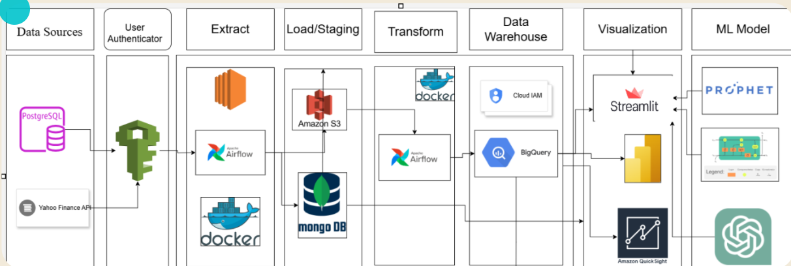
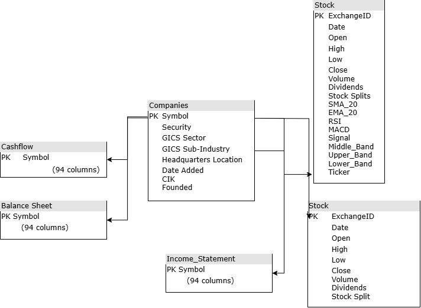

# Makeni Metrics: Real-time Stock Application

**Author**: [Long Bui](https://www.linkedin.com/in/long-bui-239009228/), [Allisa Dao](https://www.linkedin.com/in/alissadao/)

**Main Repo**: [Link](https://github.com/longbui23/Maneki-Metrics)

**Summary:**  Real-time Stock Application provides investors with up-to-data stock data. Designed for the fast-paced nature of financial markets, it delivers live updates on prices, trends, and key metrics to support informed decision-making. Key features include real-time data streaming, intuitive analytics, customizable alerts, and seamless BigQuery & AWS Cloud integration with Airflow Pipelines and ending Streamlit dashboard. 

- **Want to use a free platform to analyze S&P500 stock? Click [here](https://sp500py-hjwkxdwbaaam5as3qd4ptz.streamlit.app/) to view `Makeni Metrics` Interactive Dashboard.**
- **Link to Overview Report can be found [here](https://colab.research.google.com/drive/19TelBMBNAJJhMQisA-Pz2DYSPeU5q0Lz?authuser=1#scrollTo=JAuHFHJqAj7Q).**

## Data Collection

**<u>System Architecture:</u>**

+ **Yahoo Finance API:** API to extract key finance data
+ **PostgreSQL:** Relational DB that stores model prediction
+ **IAM Role**: Security Layer to control permission before acessing AWS Cloud
+ **Apache Airflow**: Workflow Management to create and schedule pipelines
+ **Docker**: Wrap up project's microservices
+ **EC2**: Cloud Computing Service to auto-run Airflow pipelines
+ **S3**: Cloud Object Storage acted as Staging layer
+ **MongoDB**: NoSQL Database
+ **BigQuery**: Cloud Relational DataWarehouse
+ **Streamlit**: Open-source Cloud Dashboard Infrastructure
+ **Power BI**: Microsoft visualization platform
+ **Quicksight**: Amazon Visualization Platform
+ **FBProphet**: Time Series Deep Learning Model
+ **LSTM**: Long-short Term Memory Deep Learning Model
+ **OpenAI**: Large Language Model for Chatbot

## Relational Database

**<u>BigQuery Warehouse</u>:**

- **Companies**: Information about companies in the S&P500, including attributes like sector, industry, and market capitalization.  
- **Stock**: Historical stock performance for individual S&P500 companies, including open, close, high, low prices, and trading volume. **(2+ Million Records)**
- **Cash-flow**: Details on cash flow activities for S&P500 companies, segmented into operating, investing, and financing activities.  
- **Balance Sheet**: Snapshot of S&P500 companies' financial health, with data on assets, liabilities, and equity.  
- **Income Statement**: Financial performance data for S&P500 companies, including revenue, expenses, and net income.  
- **Stock_sp500_market**: Overview of the S&P500 market's aggregated stock statistics, providing market-level insights and trends.  

**<u>Atlas MongoDB</u>:**
- **News**: Store News

## System Operations

The data collecting process involves the following steps:

1. **Extracting Data**: Data being extracted from web scrapping and yahoo finance APIs.
2. **User Authentication**: Passed passkey to AWS APIs to access role authentication
3. **Load data**: Data being extracted (temporarily in json format) is being stored in S3 bucket and MongoDB
4. **Data Processing**: Optimized Airflow to auto-process data to create new metrics and standardized formats
5. **Data Storage**: Storing data into BigQuery Warehouse
6. **Task Scheduler**: Used Airflow and pushed Airflow files into EC2 for automatic scheduling
7. **Visualization**: Utilize Streamlit and PowerBI for creating dashboards to serve non-technical users' needs

## Predictive Modelling

The project utilizes Long-short Term Memory (LTSM) models to predict future stock price (~ 1 month head).

1. **Data Preprocessing**: Load historical stock data, normalize using Min-Max scaling, and create time series sequences as input features.  
2. **Data Splitting**: Split data into training, validation, and testing sets, maintaining chronological order to avoid data leakage.  
3. **Model Design**: Build the LSTM model architecture using frameworks by TensorFlow with LSTM, Dropout, and Dense layers.  
4. **Model Training**: Train the model using MSE loss function and Adam optimizer, validating on the validation set to tune hyperparameters.  
5. **Prediction**: Use the trained model to predict stock prices for the test set and compare predictions with actual prices.  
6. **Visualization**: Plot actual vs. predicted stock prices and forecast trends for ~1 month ahead.  
7. **Hyperparameter Tuning**: Optimize performance by experimenting with parameters like sequence length, LSTM units, learning rate, and batch size.  

## Large Language Modeling (LLM)
Incorporated OpenAI LLM to make a Makeni Chatbot where users can interact with the app by typing questions and comments in to receive response.

1. **Import Model:** Import LLM after-trained model providing by OpenAI
2. **Front-end Design**: Design a front-end user interface to interact with the back-end model

## 4. Implications 

**4.1. Implications for Stakeholders:**

**<u>Investors:</u>**
- Tie to Revenue Growth and Profitability, Operational Efficiency and Management, Long-Term Value Creation
- Understanding a company’s performance helps mitigate risks and ensures they’re placing funds in financially sound and well-managed businesses.
- Market dynamics influence stock prices through broader trends and conditions that go beyond an individual company's control: Economic Climate, Industry Trends
- Relying solely on company performance without understanding market conditions can lead to poor timing, such as buying at peaks or selling during panic-driven declines.

**4.2. Ethical, Legal, and Societal Implications:**

**<u>Wealth Disparities:</u>**
- Promoting stocks that primarily benefit large corporations or wealthy investors could contribute to increasing societal inequality.
- Mitigation: Highlight opportunities for ethical and sustainable investments that support small or emerging companies.

**<u>Investment Advice Regulations:</u>**
- Providing financial recommendations can be considered investment advice and may require specific qualifications, licenses, or disclosures under regulations like the SEC (Securities and Exchange Commission) rules.
- Mitigation: Consider my suggestions as data-driven insights rather than definitive financial advice, and add disclaimers.

**<u>Market Influence and Herd Behavior:</u>**
- Recommending certain stocks could lead to concentrated investment, artificially inflating prices and creating volatility.
- Mitigation: Encourage diversification and educate audiences about the importance of balanced investment strategies.

